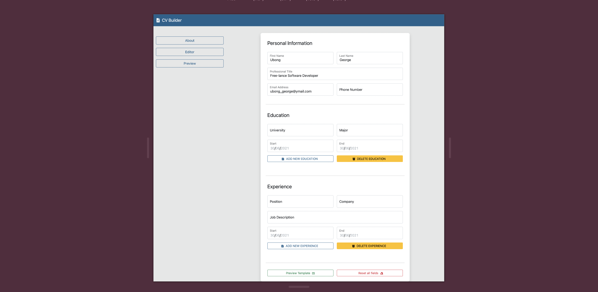

## The CV Builder App

## Live Link
[Click here](https://minimalist-cv-builder.netlify.app/) to use the CV Builder
### Objectives:
- Building a simple React application
- Using React Hooks to manage state logic
- Sharing state and props with React components
- Using React Router to manage a Single Page Application (SPA)
- Functional programming
- Meeting model client requirements

## Features
CV Builder is a single page application with three routes: `About`, `Editor` and `Preview`. The `About` page provides
information about the app. Basically, users fill in personal information and professional details and CV Builder generates a template from these details. On clicking `Get started`, users are routed to the `Editor` page. This page contains a form with the following sections:
`Personal Information`, `Education`, and `Experience`. The last two fields have two buttons `Add new (SECTION NAME)` and `Delete (SECTION NAME)` for adding multiple educational details or work experiences. At the bottom of the form, there is a button to `Preview template` which links a user to a preview of their details so far, and a `Reset all fields` button to clear all input in the editor.
The `Preview` page displays all information from the `Editor`. The page has a button at the bottom of the page `Edit Template` which allows users to edit desired details. The application is hosted on [Netlify](https://minimalist-cv-builder.netlify.app/).

## Prerequisites
- Internet Connection
- An Integrated Development Environment
- Chrome, Firefox or Safari.
- Node Package Manager [(NPM)](https://docs.npmjs.com/about-npm)

## Tools/Built With
- React
- React-DOM
- Webpack
- Javascript ES6+
- npm
- Bootstrap 5
- CSS
- Netlify

## Getting Started
- To get started with the app, clone this project by running `git clone https://github.com/george-swift/cv-builder.git`
- `cd` into the directory and run `npm install` to install the needed packages and dependencies
- Run `npm start` to fire up a local server with live reloading.
- If not already redirected, visit `http://localhost:3000/` in your browser.
- To terminate the server, enter `Ctrl + C` in your terminal

## Authors

👤 &nbsp; **Ubong George**
- LinkedIn: [Ubong George](https://www.linkedin.com/in/ubong-itok)
- Twitter: [@\_\_pragmaticdev](https://twitter.com/__pragmaticdev)
- GitHub: [@george-swift](https://github.com/george-swift)

## Acknowledgments

- [React docs](https://reactjs.org/)
- [The Odin Project](https://www.theodinproject.com/paths/full-stack-ruby-on-rails/courses/javascript/lessons/cv-application)

## Show your support

Leave a :star:️ &nbsp; if you like this project!

## License

Available as open source under the terms of the [MIT License](https://opensource.org/licenses/MIT).